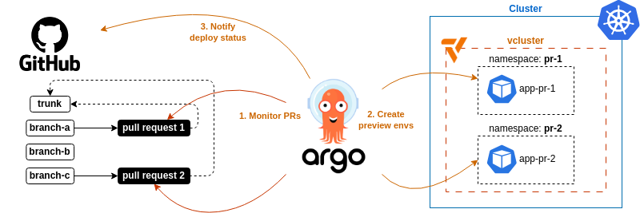
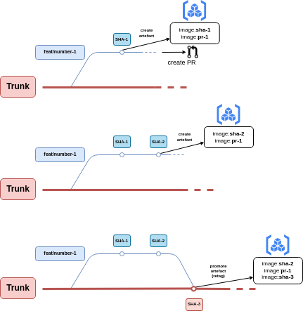
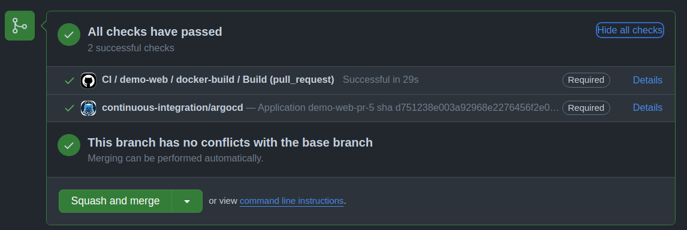

# demo-web-py
This application is using a specific workflow in combination with ArgoCD and github action.

## Workflow

<p align="center">
  
</p>

The artefact creation workflow:
- Create artefact on PR with tags `sha-<sha1>` and `pr-<pr-number>`
- Create new artefact on PR commit `sha-<sha2>` and update `pr-<pr-number>` to the new commit
- Promote artefact `pr-<pr-number>` on merge PR

PR number can be identified from a commit on Github API with following command:
```bash
gh pr list --search <sha> --state merged --json url --jq '.[0].url'
```

<p align="center">
  
</p>

ArgoCD notifies Github for successful deployment:

<p align="center">
  
</p>

To notify Github for a deployment status for a specific commit use this command:
```bash
gh api --method POST -H "Accept: application/vnd.github+json" -H "X-GitHub-Api-Version: 2022-11-28" /repos/ixxeL-DevOps/demo-web-py/statuses/<sha> -f state='success' -f description='Ephemeral env deployment' -f
context='continuous-integration/argocd'
```

Curl version:
```bash
curl -L -X POST -H "Accept: application/vnd.github+json" H "Authorization: Bearer <YOUR-TOKEN>" -H "X-GitHub-Api-Version: 2022-11-28" https://api.github.com/repos/ixxeL-DevOps/demo-web-py/statuses/<sha> -d '{"state":"success","description":"Ephemeral env deployment","context":"continuous-integration/argocd"}'
```

and check it:
```bash
gh api -H "Accept: application/vnd.github+json" -H "X-GitHub-Api-Version: 2022-11-28" /repos/ixxeL-DevOps/demo-web-py/commits/<sha>/statuses
```
Curl version:
```bash
curl -L -H "Accept: application/vnd.github+json" -H "Authorization: Bearer <YOUR-TOKEN>" -H "X-GitHub-Api-Version: 2022-11-28" https://api.github.com/repos/ixxeL-DevOps/demo-web-py/commits/<sha>/statuses
```

Documentation:
- https://docs.github.com/en/rest/commits/statuses?apiVersion=2022-11-28

## ArgoCD deployment config

Documentation :
- https://argo-cd.readthedocs.io/en/stable/operator-manual/notifications/templates/


Here is the description of the ArgoCD `ApplicationSet` responsible for app creation:
```yaml
---
apiVersion: argoproj.io/v1alpha1
kind: ApplicationSet
metadata:
  name: demo-web-preview
spec:
  generators:
    - pullRequest:
        github:
          owner: ixxeL-DevOps
          repo: demo-web-py
          tokenRef:
            key: github_token
            secretName: github-creds
        requeueAfterSeconds: 60
  template:
    metadata:
      name: 'demo-web-pr-{{number}}'
      annotations:
        notifications.argoproj.io/subscribe.on-ephemeral-deployed.github: ""
        notifications.argoproj.io/subscribe.on-ephemeral-health-degraded.github: ""
        notifications.argoproj.io/subscribe.on-ephemeral-sync-failed.github: ""
    spec:
      destination:
        namespace: 'demo-web-pr-{{number}}'
        name: 'vk-pprod'
      project: ephemeral
      source:
        path: deploy/
        repoURL: 'https://github.com/ixxeL-DevOps/demo-web-py.git'
        targetRevision: '{{branch}}'
        helm:
          releaseName: 'demo-web-pr-{{number}}'
          parameters:
            - name: tag
              value: 'sha-{{head_sha}}'
            - name: name
              value: 'demo-web-pr-{{number}}'
      syncPolicy:
        automated:
          prune: true
          selfHeal: true
        syncOptions:
          - Validate=true
          - PruneLast=false
          - RespectIgnoreDifferences=true
          - Replace=false
          - ApplyOutOfSyncOnly=true
          - CreateNamespace=true
          - ServerSideApply=true
        retry:
          limit: 2 # number of failed sync attempt retries; unlimited number of attempts if less than 0
          backoff:
            duration: 5s # the amount to back off. Default unit is seconds, but could also be a duration (e.g. "2m", "1h")
            factor: 2 # a factor to multiply the base duration after each failed retry
            maxDuration: 3m # the maximum amount of time allowed for the backoff strategy
      info:
      - name: url
        value: 'https://demo-web-pr-{{number}}.k8s-app.fredcorp.com/'

```

Notice the annotation for webhook callback to Github:
```yaml
annotations:
  notifications.argoproj.io/subscribe.on-ephemeral-deployed.github: ""
  notifications.argoproj.io/subscribe.on-ephemeral-health-degraded.github: ""
  notifications.argoproj.io/subscribe.on-ephemeral-sync-failed.github: ""
```

And here is the configuration for ArgoCD:

```yaml
secret:
  name: repo-creds-github # uses this secret to fetch the 'password' key in it (which has access to api Github for notifications)

notifiers:
  service.webhook.github: |
    url: https://api.github.com
    headers:
    - name: Authorization
      value: token $password

triggers:
  trigger.on-ephemeral-deployed: |
    - description: Application is synced and healthy. Triggered once per commit.
      oncePer: app.status.operationState.syncResult.revision
      send:
      - github-commit-status
      when: app.status.operationState.phase in ['Succeeded'] and app.status.health.status == 'Healthy' and app.status.sync.status == 'Synced'
  trigger.on-ephemeral-health-degraded: |
    - description: Application has degraded
      oncePer: app.status.operationState.syncResult.revision
      send:
      - github-commit-status
      when: app.status.health.status == 'Degraded'
  trigger.on-ephemeral-sync-failed: |
    - description: Application syncing has failed
      oncePer: app.status.operationState.syncResult.revision
      send:
      - github-commit-status
      when: app.status.operationState.phase in ['Error', 'Failed']

templates:
  template.github-commit-status: |
    webhook:
      github:
        method: POST
        path: /repos/{{call .repo.FullNameByRepoURL .app.spec.source.repoURL}}/statuses/{{.app.status.operationState.operation.sync.revision}}
        body: |
          {
            {{if eq .app.status.operationState.phase "Running"}} "state": "pending"{{end}}
            {{if eq .app.status.operationState.phase "Succeeded"}} "state": "success"{{end}}
            {{if eq .app.status.operationState.phase "Error"}} "state": "error"{{end}}
            {{if eq .app.status.operationState.phase "Failed"}} "state": "error"{{end}},
            "description": "{{.app.metadata.name}} img tag: {{.app.status.operationState.operation.sync.revision}}",
            "target_url": "{{.context.argocdUrl}}/applications/{{.app.metadata.name}}",
            "context": "continuous-integration/argocd"
          }
```

`ApplicationSet` points to the repository where the code lives. You can use an umbrella chart to automatically pull the latest version of the deployment in the `deploy` directory:
```yaml
apiVersion: v2
name: demo-web
version: 1.0.0
dependencies:
- name: demo-web
  version: '*'
  repository: https://chartmuseum.k8s-app.fredcorp.com
```

see the helm version constraints documentation:
- https://github.com/Masterminds/semver#checking-version-constraints


This setup allows for `{{.app.status.operationState.operation.sync.revision}}` usage when setting `targetRevision: '{{branch}}'` for the ApplicationSet.

If you prefer not to, you can use specific `{{ (call .repo.GetAppDetails).Helm.GetParameterValueByName "tag" }}` call function to target a Helm parameter from your release.

Argocd display application information:
```bash
argocd app get argocd/demo-web-pr-5 --grpc-web --show-params --show-operation
```

result:
```
Name:               argocd/demo-web-pr-5
Project:            ephemeral
Server:             vk-pprod
Namespace:          demo-web-pr-5
URL:                https://argocd.k8s-app.fredcorp.com/applications/demo-web-pr-5
Repo:               https://github.com/ixxeL-DevOps/demo-web-py.git
Target:             feat/ephemeral4
Path:               deploy/
SyncWindow:         Sync Allowed
Sync Policy:        Automated (Prune)
Sync Status:        Synced to feat/ephemeral4 (d751238)
Health Status:      Healthy

Operation:          Sync
Sync Revision:      d751238e003a92968e2276456f2e0e3ac2ba7216
Phase:              Succeeded
Start:              2024-03-24 17:02:22 +0100 CET
Finished:           2024-03-24 17:02:25 +0100 CET
Duration:           3s
Message:            successfully synced (all tasks run)


NAME  VALUE
tag   sha-d751238e003a92968e2276456f2e0e3ac2ba7216
name  demo-web-pr-5

GROUP              KIND        NAMESPACE      NAME           STATUS   HEALTH   HOOK  MESSAGE
                   Namespace                  demo-web-pr-5  Running  Synced         namespace/demo-web-pr-5 serverside-applied
                   Service     demo-web-pr-5  demo-web-pr-5  Synced   Healthy        service/demo-web-pr-5 serverside-applied
apps               Deployment  demo-web-pr-5  demo-web-pr-5  Synced   Healthy        deployment.apps/demo-web-pr-5 serverside-applied
networking.k8s.io  Ingress     demo-web-pr-5  demo-web-pr-5  Synced   Healthy        ingress.networking.k8s.io/demo-web-pr-5 serverside-applied
```

The line :
```
"description": "{{.app.metadata.name}} img tag: {{ (call .repo.GetAppDetails).Helm.GetParameterValueByName "tag" }}",
```

Reference :
```
NAME  VALUE
tag   sha-d751238e003a92968e2276456f2e0e3ac2ba7216
```

You can also gather the commit sha within helm parameter and adapt it:

```yaml
templates:
  template.github-commit-status: |
    webhook:
      github:
        method: POST
        {{ $sha := (split "-" ((call .repo.GetAppDetails).Helm.GetParameterValueByName "tag"))._1 }}
        path: /repos/{{call .repo.FullNameByRepoURL .app.spec.source.repoURL}}/statuses/{{ $sha }}
        body: |
          {
            {{if eq .app.status.operationState.phase "Running"}} "state": "pending"{{end}}
            {{if eq .app.status.operationState.phase "Succeeded"}} "state": "success"{{end}}
            {{if eq .app.status.operationState.phase "Error"}} "state": "error"{{end}}
            {{if eq .app.status.operationState.phase "Failed"}} "state": "error"{{end}},
            "description": "{{.app.metadata.name}} img tag: {{ (call .repo.GetAppDetails).Helm.GetParameterValueByName "tag" }}",
            "target_url": "{{.context.argocdUrl}}/applications/{{.app.metadata.name}}",
            "context": "continuous-integration/argocd"
          }
```

## Testing 

You can test application with a postsync hook. Add this job to the helm chart:

```yaml
---
apiVersion: batch/v1
kind: Job
metadata:
  generateName: e2e-tests-
  annotations:
    argocd.argoproj.io/hook: PostSync
spec:
  template:
    spec:
      containers:
      - name: e2e-tests
        image: alpine
        command:
          - "/bin/bash"
          - "-c"
          - |
            apk add curl bash
            response_code=$(curl -fsSkLw "%{http_code}" "http://{{ .Values.name }}.{{ .Release.Namespace}}.svc.cluster.local:8080" -o /dev/null)
            echo "Response code is $response_code"
            if [ $response_code -eq 200 ]; then
              echo "SUCCESS : response code is $response_code"
              exit 0
            else
              echo "FAIL : response code is $response_code"
              exit 1
            fi
      restartPolicy: Never
  backoffLimit: 0
```

Job will be launched after app is sync.

## Trigger

Github action let you triggers workflow manually. It can be coupled with ArgoCD notification.

Documentation:
- https://docs.github.com/en/rest/actions/workflows?apiVersion=2022-11-28

```bash
curl -L -X POST -H "Accept: application/vnd.github+json" -H "Authorization: Bearer <YOUR-TOKEN>" -H "X-GitHub-Api-Version: 2022-11-28" https://api.github.com/repos/OWNER/REPO/actions/workflows/WORKFLOW_ID/dispatches -d '{"ref":"topic-branch","inputs":{"name":"Mona the Octocat","home":"San Francisco, CA"}}'
```